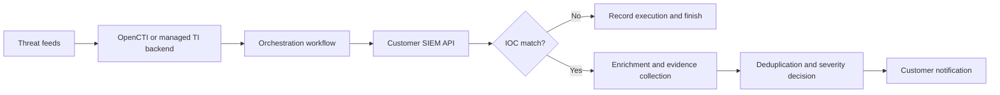

# IOC Hunt & Notify

Managed IOC hunting and notification service built around a centrally operated threat-intelligence backend, automated orchestration, customer SIEM APIs, enrichment and customer notifications.

## Current product scope

The service continuously processes selected indicators of compromise, searches for them in customer SIEM platforms, enriches confirmed matches and sends actionable notifications.

The provider operates the backend components. The customer only provides the approved SIEM API access and receives notifications through the agreed channel.

Supported target integrations for the MVP:

- IBM QRadar
- Microsoft Defender XDR
- Splunk
- FortiSIEM
- Email, Microsoft Teams, Slack or ticket-based notifications

Only one SIEM adapter and one notification channel should be implemented for the first vertical slice.

## Core flow

## Customer-visible surface

The customer receives only the notification and the evidence needed for investigation. The feed management, IOC lifecycle, enrichment logic, queries, workflow execution and backend operation remain provider-managed.

## Start here with Claude

1. Open the repository in Claude Code.
2. Ask Claude to read [`CLAUDE.md`](CLAUDE.md).
3. Use [`prompts/CLAUDE_BOOTSTRAP.md`](prompts/CLAUDE_BOOTSTRAP.md) for the first planning session.
4. Use [`prompts/FEATURE_TASK_TEMPLATE.md`](prompts/FEATURE_TASK_TEMPLATE.md) for focused implementation sessions.

## Repository map

| Path | Purpose |
|---|---|
| `CLAUDE.md` | Always-on project rules, scope and definition of done |
| `.claude/skills/` | On-demand product, SIEM-adapter and security-review context |
| `docs/PRODUCT_POSITIONING_HU.md` | Hungarian commercial and service positioning |
| `docs/PRODUCT_REQUIREMENTS.md` | MVP use cases and non-functional requirements |
| `docs/ARCHITECTURE.md` | Target components, trust boundaries and deployment direction |
| `docs/DATA_MODEL.md` | Initial logical domain model |
| `docs/WORKFLOW_SPEC.md` | End-to-end state machine, retry and deduplication behavior |
| `docs/INTEGRATION_CONTRACTS.md` | TI, SIEM, enrichment and notification adapter contracts |
| `docs/SECURITY.md` | Threat model and security gates |
| `docs/OPERATIONS_AND_SIZING.md` | Monitoring, capacity inputs, risks and recovery |
| `docs/DELIVERY_PLAN.md` | Ordered delivery phases and initial backlog |
| `docs/ACCEPTANCE_CRITERIA.md` | Testable MVP completion criteria |
| `docs/CUSTOMER_ONBOARDING.md` | Presales, access, testing and go-live checklist |
| `docs/OPEN_DECISIONS.md` | Decisions Claude must not silently make |

## Important limitation

This is an MVP for a managed black-box service. It is not currently intended to become:

- a customer-facing CTI portal;
- a replacement SIEM;
- an attack-surface management platform;
- a dark-web monitoring platform;
- an autonomous response system.

## Security notice

Do not commit customer names, production credentials, API tokens, real tenant identifiers or unredacted customer telemetry. Use synthetic fixtures and environment-variable placeholders only.
