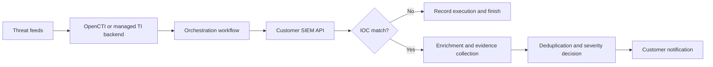

# IOC Hunt & Notify

Managed IOC hunting and notification service built around a centrally operated threat-intelligence backend, automated orchestration, customer SIEM APIs, enrichment and customer notifications.

## Current product scope

The service continuously processes selected indicators of compromise, searches for them in customer SIEM platforms, enriches confirmed matches and sends actionable notifications.

The provider operates the backend components. The customer only provides the approved SIEM API access and receives notifications through the agreed channel.

Supported target integrations for the MVP:

- IBM QRadar
- Microsoft Defender XDR
- Splunk
- FortiSIEM
- Email, Microsoft Teams, Slack or ticket-based notifications

## Core flow

## Customer-visible surface

The customer receives only the notification and the evidence needed for investigation. The feed management, IOC lifecycle, enrichment logic, queries, workflow execution and backend operation remain provider-managed.

## Repository purpose

This repository is the source of truth for product requirements, architecture, security requirements, integration contracts, workflow design and the future implementation.

Start with [`CLAUDE.md`](CLAUDE.md), then read the documents referenced there.

## Important limitation

This is an MVP for a managed black-box service. It is not currently intended to become:

- a customer-facing CTI portal;
- a replacement SIEM;
- an attack-surface management platform;
- a dark-web monitoring platform;
- an autonomous response system.

## Security notice

Do not commit customer names, production credentials, API tokens, real tenant identifiers or unredacted customer telemetry. Use synthetic fixtures and environment-variable placeholders only.
