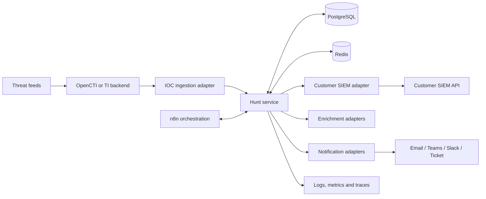

# Architecture

## 1. Architectural objective

Provide a secure, supportable and SIEM-agnostic managed IOC hunting service. The architecture must allow new SIEM and notification adapters without duplicating workflow logic.

## 2. System context



## 3. Component responsibilities

### TI backend

OpenCTI or a compatible managed source remains the source of threat-intelligence context. It is not the execution engine and not the source of truth for customer hunt state.

Responsibilities:

- feed ingestion and curation;
- IOC provenance and confidence;
- indicator lifecycle;
- labels and markings;
- relationships and contextual intelligence.

### Hunt service

The application core owns durable workflow state and business rules.

Responsibilities:

- IOC validation and canonicalization;
- customer policy evaluation;
- hunt job creation;
- deduplication and idempotency;
- SIEM adapter invocation;
- evidence normalization;
- enrichment orchestration;
- severity decision;
- notification preparation;
- audit trail and operational status.

### n8n

n8n provides transparent orchestration and integration flow visibility for operators.

It may:

- trigger internal APIs;
- coordinate approved steps;
- route operational errors;
- invoke notification or ticket workflows;
- support manual operator approval steps later.

It must not be the sole location of:

- customer configuration;
- IOC lifecycle state;
- idempotency keys;
- evidence records;
- notification delivery status;
- business-critical audit history.

Workflow exports must not contain credentials.

### PostgreSQL

The source of truth for:

- customers and integrations;
- IOC references and normalized values;
- hunt policies;
- hunt executions;
- evidence metadata;
- enrichment summaries;
- deduplication records;
- notifications and delivery attempts;
- audit events.

### Redis

Used for:

- work queues;
- distributed locks;
- short-lived cache;
- rate-limit counters;
- temporary connector state.

Redis must not be the only copy of business-critical information.

### SIEM adapters

Each adapter implements a common contract and contains platform-specific:

- authentication;
- query rendering;
- asynchronous search handling;
- pagination;
- rate limits;
- response validation;
- evidence normalization;
- cancellation and timeout behavior.

### Enrichment adapters

Enrichment is optional and policy-controlled. Each result records source, request time, response status, confidence contribution and expiry.

### Notification adapters

Notification adapters receive a canonical notification object. Templates must remain channel-specific but use the same underlying evidence and identifiers.

## 4. Recommended deployment model

### Local development

Docker Compose with:

- API and worker container;
- PostgreSQL;
- Redis;
- n8n;
- mock OpenCTI API;
- mock SIEM API;
- local mail sink or webhook receiver.

Do not require full OpenCTI or a real SIEM for normal automated tests.

### Pilot

Minimum separation:

- application/API and workers;
- PostgreSQL;
- Redis;
- n8n;
- reverse proxy or ingress;
- external secret store;
- central observability.

### Production direction

- multiple stateless workers;
- highly available or managed PostgreSQL;
- durable Redis deployment appropriate for queue semantics;
- encrypted backup and tested restore;
- network allowlisting to customer SIEM endpoints;
- per-customer credentials and egress controls;
- separate non-production and production environments.

## 5. Logical modules

```text
src/
  api/
  domain/
    ioc/
    hunt/
    evidence/
    enrichment/
    notification/
    customer_policy/
  adapters/
    ti/
    siem/
    enrichment/
    notification/
  persistence/
  workers/
  observability/
  security/
workflows/
  n8n/
tests/
  unit/
  integration/
  contract/
  e2e/
```

Start as a modular monolith. A module may become a service only after a measured scaling, isolation or release-management need is documented.

## 6. Core data flow

1. The TI adapter receives or polls an IOC.
2. The core validates and canonicalizes the value.
3. The IOC is linked to source, confidence, markings and lifecycle.
4. Customer policies determine eligible hunts.
5. A unique hunt execution is created.
6. The SIEM adapter renders a parameterized query.
7. The adapter executes and normalizes results.
8. No-match executions finish without a customer alert.
9. Matches become canonical evidence records.
10. Enrichment adapters add context.
11. The decision component calculates severity and confidence.
12. Deduplication decides whether to create, update or suppress a notification.
13. The notification adapter delivers the message.
14. Every state transition is audited.

## 7. Trust boundaries

- External threat-intelligence content is untrusted.
- Customer SIEM responses are untrusted.
- Enrichment provider responses are untrusted.
- Notification templates must escape untrusted values.
- n8n inputs and webhook payloads require authentication and validation.
- Customer credentials must be isolated from other customer contexts.
- Provider administration and customer API traffic must use separate authorization scopes.

## 8. Availability and failure model

Expected failures include:

- unavailable TI backend;
- expired customer credentials;
- SIEM query timeout;
- SIEM API throttling;
- malformed external response;
- enrichment quota exhaustion;
- notification endpoint failure;
- duplicated events;
- worker restart during execution.

The architecture must convert these into explicit states and operator-visible metrics rather than silent workflow termination.

## 9. Architectural non-goals

- central collection of customer raw logs;
- replacement of the customer's incident management process;
- direct endpoint isolation or firewall blocking;
- customer-facing graph exploration;
- full STIX graph implementation in the application database;
- unrestricted internet access from every component.
