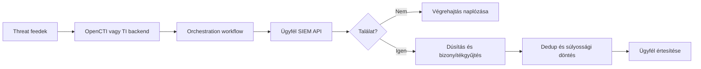

# Termékpozicionálás

## IOC Hunt & Notify

**Felügyelt IOC-vadászat és értesítő szolgáltatás.**

A szolgáltató teljes körűen üzemelteti a threat-intelligence és hunting hátteret, lekérdezi az ügyfél meglévő SIEM-rendszerét, majd releváns találat esetén dúsított és feldolgozható értesítést küld.

## Amit a szolgáltató végez

- Üzemelteti az OpenCTI-t vagy a kompatibilis saját TI backendet.
- Fejleszti, verziózza és futtatja az orchestration workflow-kat.
- Integrálja az ügyfél SIEM API-ját.
- Kezeli a feedeket, az IOC-k életciklusát, normalizálását és dúsítását.
- Karbantartja a SIEM-specifikus kereséseket.
- Felügyeli a workflow-k végrehajtását, hibakezelését és újrapróbálását.
- Találat esetén bizonyítékot gyűjt, súlyosságot állapít meg, deduplikál és értesítést készít.
- Naplózza az IOC, a keresés, a találat, a dúsítás és az értesítés közötti kapcsolatot.

## Amit az ügyfél végez

- Biztosítja a jóváhagyott, minimális jogosultságú SIEM API-hozzáférést.
- Meghatározza az értesítési csatornákat és címzetteket.
- Jóváhagyja az onboarding során alkalmazott keresési és értesítési paramétereket.
- A kapott értesítés alapján saját incidenskezelési folyamata szerint jár el.

## Amit az ügyfél lát

Az ügyfél elsődlegesen az értesítést látja, például:

- email;
- Microsoft Teams;
- Slack;
- Jira, ServiceNow vagy más ticketing integráció.

Az értesítés minimális tartalma:

- mely IOC-ra érkezett találat;
- melyik környezetben és időablakban;
- milyen SIEM-bizonyíték támasztja alá;
- milyen forrásból származik az IOC;
- enrichment összefoglaló;
- súlyosság és confidence;
- javasolt következő elemzési lépések;
- egyedi investigation és deduplikációs azonosító.

## Black-box működés

Az ügyfélnek nem kell:

- OpenCTI-t vagy más TI backendet telepítenie;
- feedeket kezelnie;
- IOC-forrásokat karbantartania;
- SIEM queryket fejlesztenie;
- workflow-logikát üzemeltetnie;
- enrichment API-kat integrálnia.

A backend komponensek szolgáltatói oldalon működnek. Az ügyfélnél kizárólag az engedélyezett SIEM API-kapcsolat és az értesítési csatorna szükséges.

## Magas szintű architektúra

## MVP-ben támogatandó SIEM-ek

A céladapterek:

- IBM QRadar;
- Microsoft Defender XDR;
- Splunk;
- FortiSIEM.

A fejlesztés első körében azonban csak **egy pilot SIEM-adaptert** szabad teljesen implementálni. A további adapterek ugyanarra a belső szerződésre épüljenek.

## Nem része a jelenlegi scope-nak

- ügyféloldali CTI portál;
- teljes OpenCTI-alternatíva;
- saját SIEM vagy logtárolás;
- dark web monitoring;
- attack surface management;
- malware sandbox;
- automatikus blokkolás vagy izoláció;
- teljes SOC case management;
- kontroll nélküli AI-döntéshozatal.

## Javasolt ügyfélkommunikáció

> Az IOC Hunt & Notify egy felügyelt threat hunting szolgáltatás, amely a szolgáltatói oldalon kezelt threat intelligence alapján rendszeresen ellenőrzi az ügyfél meglévő SIEM-rendszerét. Releváns találat esetén bizonyítékkal és enrichment kontextussal ellátott értesítést küld, miközben az IOC-források, queryk és workflow-k üzemeltetését a szolgáltató végzi.
