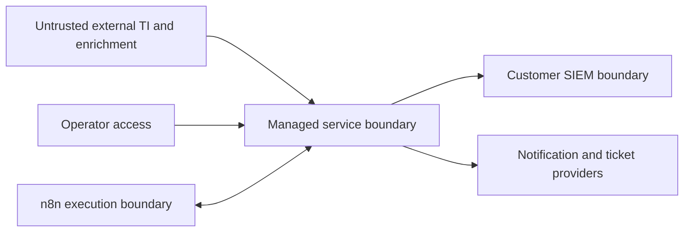

# Security and threat model

## 1. Security objective

The service processes external threat-intelligence data and queries customer security platforms with privileged API access. A compromise could expose customer telemetry, create misleading alerts, consume SIEM resources or become a pivot into customer environments. Security controls are therefore part of the product, not a later hardening phase.

## 2. Protected assets

- customer SIEM credentials and secret references;
- customer identifiers and integration configuration;
- SIEM query templates and approved data scope;
- hunt executions and evidence;
- threat-intelligence source data and markings;
- notification recipients and ticket identifiers;
- operator identities and administrative actions;
- audit logs and delivery history;
- service signing keys and encryption material.

## 3. Trust boundaries

All content crossing these boundaries must be authenticated where possible, validated, bounded, encoded and logged safely.

## 4. Primary threats and controls

### T-01: Credential leakage

Risks:

- tokens committed to Git;
- credentials stored in n8n exports;
- secrets printed in logs or exception messages;
- one customer's credentials used in another context.

Controls:

- external secret store or managed secret mechanism;
- repository secret scanning;
- structured redaction;
- secret references rather than values in persisted configuration;
- per-customer credential objects;
- short-lived credentials where supported;
- rotation and emergency revocation procedure.

### T-02: Prompt or instruction injection through CTI content

Risks:

- malicious text in threat reports or enrichment results instructs an AI component or operator automation to execute actions;
- external content is interpreted as code, query or template instruction.

Controls:

- treat external content strictly as data;
- do not pass untrusted descriptions into privileged agent instructions;
- isolate AI summarization from tool execution;
- use deterministic templates for queries and notifications;
- no autonomous containment;
- output validation and length limits.

### T-03: SIEM query injection or overly broad queries

Risks:

- malformed IOC changes query semantics;
- query scans excessive data and impacts SIEM performance;
- customer scope is bypassed.

Controls:

- IOC type-specific normalization;
- parameterization or strict escaping;
- versioned query templates;
- fixed maximum lookback and result count;
- customer-approved index, tenant or data-source scope;
- query timeout and cancellation;
- pre-production validation against representative environments.

### T-04: Cross-customer data exposure

Risks:

- wrong customer context attached to a job;
- shared cache keys collide;
- notifications are sent to another customer;
- operator query returns multiple customers unintentionally.

Controls:

- customer ID mandatory in all domain objects and persistence operations;
- scoped repositories and authorization checks;
- customer included in idempotency, cache and deduplication keys;
- separate credentials and notification configuration;
- authorization and isolation tests;
- notification recipient allowlists.

### T-05: Duplicate or misleading notifications

Risks:

- retries create multiple tickets;
- stale IOC generates repeated alerts;
- partial data is presented as confirmed malicious activity.

Controls:

- stable idempotency keys;
- deterministic evidence fingerprints;
- explicit severity and confidence;
- source and timestamp disclosure;
- suppression and update policies;
- wording that distinguishes evidence, enrichment verdict and analyst conclusion.

### T-06: Compromised integration endpoint

Risks:

- fake SIEM or enrichment response;
- DNS or certificate interception;
- webhook spoofing.

Controls:

- TLS validation;
- endpoint allowlisting;
- certificate or private network controls when required;
- webhook signatures or mutual authentication;
- response schema validation;
- bounded payload size.

### T-07: n8n compromise or workflow abuse

Risks:

- credentials exposed to workflow editors;
- arbitrary nodes execute commands or access the internet;
- sensitive payloads retained in workflow history.

Controls:

- role-based administrative access;
- minimal node set where operationally possible;
- credentials stored in approved secret mechanisms;
- workflow export review;
- execution-data retention policy;
- no unrestricted shell execution in production;
- n8n invokes narrow internal APIs rather than customer systems directly where feasible.

### T-08: Denial of service and cost amplification

Risks:

- excessive feed volume creates SIEM query storms;
- enrichment quotas are exhausted;
- poison messages retry indefinitely.

Controls:

- per-customer and per-adapter rate limits;
- queue backpressure;
- concurrency limits;
- bounded retries and dead-letter queue;
- IOC prioritization and expiry;
- query budget metrics;
- emergency pause switch per customer and integration.

## 5. Authorization model

Initial roles:

- `platform_admin`: infrastructure and global configuration;
- `service_operator`: workflows, customer integrations and execution review;
- `security_reviewer`: audit and configuration review;
- `read_only_operator`: operational visibility without mutation.

Customer-facing roles are not required until a customer portal is introduced.

High-risk operations should require explicit authorization and audit, including:

- changing a SIEM endpoint or credential reference;
- expanding query scope;
- changing notification recipients;
- disabling deduplication;
- enabling a new enrichment provider;
- exporting evidence;
- changing retention.

## 6. Data handling

Classify and handle at least:

- public threat-intelligence data;
- restricted or TLP-marked intelligence;
- customer configuration;
- customer telemetry excerpts;
- credentials;
- audit records.

Requirements:

- respect source markings and licence constraints;
- retain only evidence required for the service and contract;
- prefer source references or bounded summaries over raw event storage;
- encrypt data in transit;
- encrypt sensitive persistence and backups;
- define retention and deletion per data category;
- prevent customer data from entering development fixtures.

## 7. Logging rules

Logs may include:

- correlation ID;
- customer pseudonymous identifier;
- integration identifier;
- adapter and operation;
- status, duration and result count;
- normalized error category.

Logs must not include:

- access or refresh tokens;
- authorization headers;
- complete SIEM events by default;
- unbounded external descriptions;
- notification recipient secrets;
- database connection strings;
- another customer's data.

## 8. Secure development requirements

- dependency pinning and vulnerability scanning;
- static analysis and type checking;
- secret scanning;
- code review for adapter and authorization changes;
- contract tests for malformed external responses;
- negative tests for cross-customer access;
- software bill of materials for releases;
- signed or traceable build artifacts;
- documented rollback.

## 9. Security acceptance gate

No pilot deployment until:

- all credentials are externalized;
- customer isolation tests pass;
- query templates are reviewed;
- webhook and API authentication are validated;
- logs are checked for secret and telemetry leakage;
- backup and restore are tested;
- incident response contacts and revocation steps are documented;
- automatic blocking remains disabled.
