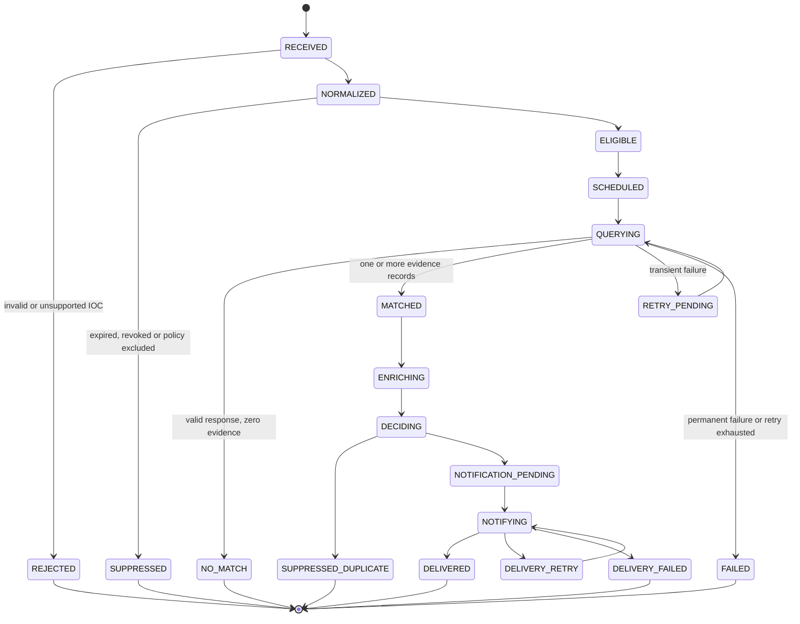

# Workflow specification

## 1. Canonical workflow



## 2. IOC intake

Input fields:

- source identifier;
- source object identifier;
- IOC type;
- IOC value;
- confidence;
- labels;
- valid-from and valid-until;
- handling marking;
- optional context summary.

Validation rules:

- normalize casing and encoding where semantically safe;
- reject malformed values;
- do not follow URLs during validation;
- distinguish IP addresses from CIDR ranges;
- retain original value for provenance;
- generate a canonical fingerprint from type and normalized value;
- avoid logging raw fields that may contain secrets or excessive external text.

## 3. Eligibility

An IOC is eligible for a customer when:

- the IOC is active;
- the IOC type is enabled by policy;
- source confidence meets the threshold;
- source and labels are not excluded;
- handling markings allow the processing and notification path;
- the relevant SIEM adapter is enabled;
- the integration is operational;
- a hunt for the same policy window is not already active or completed.

## 4. Hunt creation

A hunt execution receives an idempotency key derived from stable inputs, for example:

```text
customer_id + integration_id + ioc_fingerprint + policy_version + time_window_start + time_window_end
```

Creating the same hunt twice must return the existing execution rather than create a duplicate.

## 5. Query construction

The core provides the adapter with:

- normalized IOC;
- customer-approved data scope;
- start and end timestamps;
- maximum result count;
- query timeout;
- policy and template version;
- correlation identifier.

The adapter must use platform-safe parameterization or escaping. It must not concatenate untrusted descriptive text into a SIEM query.

## 6. Query execution

Possible outcomes:

### Success, no match

- status: `NO_MATCH`;
- result count: zero;
- execution duration recorded;
- query and template versions recorded;
- no customer alert.

### Success, match

- status: `MATCHED`;
- each result normalized to canonical evidence;
- raw payload stored only when explicitly allowed and safely protected;
- otherwise store a bounded excerpt, hash or retrievable reference;
- continue to enrichment and decision.

### Transient failure

Examples:

- timeout;
- HTTP 429;
- HTTP 5xx;
- temporary connection failure;
- asynchronous search not complete within the current polling cycle.

Action:

- transition to `RETRY_PENDING`;
- exponential backoff with jitter;
- retain the same hunt execution and idempotency key;
- stop after configured retry or age limit.

### Permanent failure

Examples:

- authentication rejected;
- authorization missing;
- invalid query template;
- unsupported adapter configuration;
- malformed configuration.

Action:

- mark failed;
- create an operator alert;
- do not send a threat notification to the customer unless the contract includes service-health reporting.

## 7. Canonical evidence

Each evidence record should contain:

- evidence identifier;
- customer and integration identifiers;
- hunt execution identifier;
- IOC fingerprint;
- event timestamp;
- ingestion or observation timestamp where available;
- source product and dataset;
- source and destination address when available;
- user, host, process, file, URL or domain fields when available;
- bounded event summary;
- source record reference;
- evidence fingerprint;
- normalization warnings.

Never assume identical field names or semantics across SIEMs.

## 8. Enrichment

Enrichment runs only for matched IOCs unless policy says otherwise.

For each enrichment call record:

- provider;
- request timestamp;
- result status;
- result expiry;
- confidence contribution;
- bounded summary;
- raw response reference when retention is allowed;
- rate-limit metadata;
- error category.

One failed enrichment source must not automatically discard valid SIEM evidence.

## 9. Severity decision

Initial deterministic inputs may include:

- IOC source confidence;
- number and quality of independent TI sources;
- recency of intelligence;
- SIEM evidence recency;
- number of distinct affected assets or identities;
- inbound, outbound or execution context;
- asset criticality supplied by customer policy;
- enrichment verdict;
- known benign or allowlist match.

The output must include:

- severity;
- confidence;
- human-readable reason codes;
- decision policy version.

Do not rely on an opaque AI-only score.

## 10. Deduplication

Recommended deduplication key:

```text
customer_id + ioc_fingerprint + evidence_identity + notification_policy_version
```

Policy options:

- suppress within a time window;
- update an existing ticket;
- send only when severity increases;
- send only when a new asset or identity is affected;
- reopen after a configurable quiet period.

Every suppression must remain auditable.

## 11. Notification delivery

Notification creation and notification delivery are separate steps.

The canonical notification is rendered by a channel adapter. Delivery retries reuse the same logical notification identifier. A retry must not create a second ticket or duplicate message when the remote channel supports idempotency or update operations.

## 12. n8n workflow boundary

A suggested n8n flow:

```text
Trigger
  -> request eligible work from Hunt Service
  -> start or resume hunt
  -> wait/poll through Hunt Service API
  -> branch on terminal result
  -> request notification delivery when required
  -> publish operational failure when required
```

n8n nodes should exchange identifiers and compact status objects. Large SIEM payloads and secrets must not be passed through workflow histories unless explicitly protected and required.
